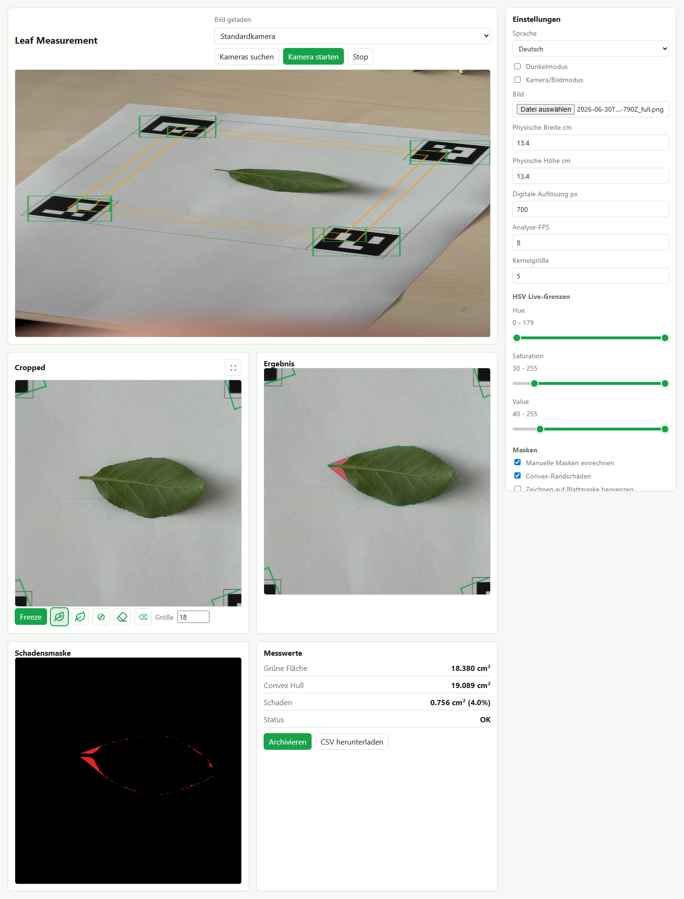
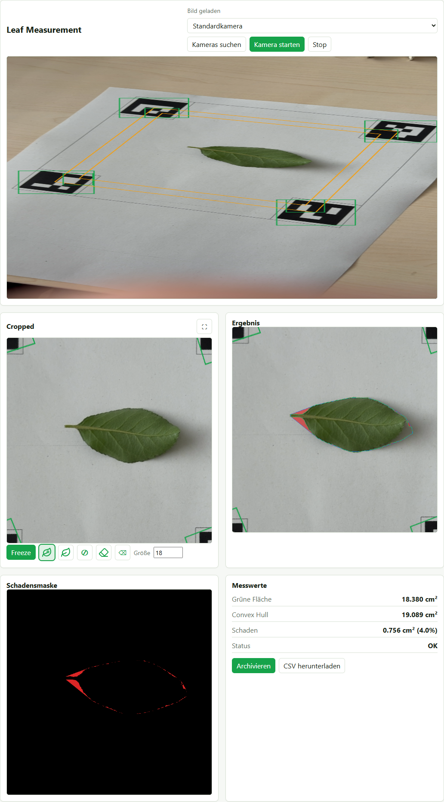
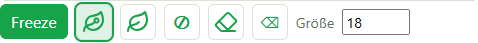
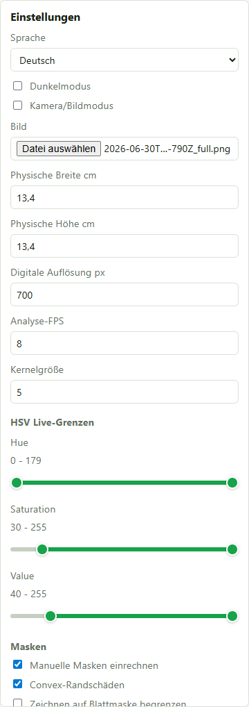
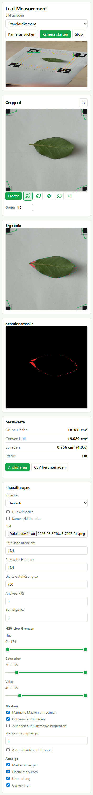

# Leaf Measurement

Leaf Measurement ist eine webbasierte Anwendung zum Vermessen von Blättern innerhalb eines Marker-Quadrats. Die App läuft später unter:

**https://leafmeasurement.casparniemeyer.com**

Die Bildverarbeitung läuft vollständig im Browser. Das Node-Backend stellt nur die Website bereit und speichert Messungen, wenn der Benutzer aktiv auf **Archivieren** klickt.



## Kurzüberblick

- Kamera- oder Bilddatei als Eingabe
- Marker-basierter Zuschnitt der Messfläche
- Perspektivkorrektur auf eine quadratische Arbeitsfläche
- HSV-Farbfilter für die Blattsegmentierung
- Convex-Hull-Schätzung für Rand- und Flächenschäden
- Manuelle Werkzeuge zum Einzeichnen, Korrigieren und Entfernen von Bereichen
- Benutzeraccounts mit E-Mail-Bestätigung und Passwort-Reset
- Projekte mit Mitgliedern, Join-Link und geteiltem Archiv
- CSV-Archiv pro Projekt mit optional gespeicherten Bildansichten
- Clientseitige Analyse ohne kontinuierlichen Upload von Kamerabildern

## Architektur

Die Anwendung besteht aus einer statischen Browser-App und einem kleinen Node-Server.

```text
Browser
  Kamera / Bilddatei
  Marker-Erkennung
  Perspective Crop
  HSV-Maske
  Convex Hull
  manuelle Masken
  Messwerte

Node Backend
  statische Dateien ausliefern
  Benutzer, Sessions und Projektmitgliedschaften verwalten
  E-Mail-Verifizierung und Passwort-Reset-Tokens erzeugen
  Archiv-POST entgegennehmen
  Projekt-CSV herunterladen
  Projekt-Archivbilder geschützt ausliefern
```

Wichtige Dateien:

- `public/index.html`: Oberfläche der App
- `public/styles.css`: Layout, Farben, responsive Ansicht
- `public/app.js`: komplette clientseitige Bildanalyse
- `server.js`: Node-Backend für Hosting, Archiv und CSV
- `data/app-db.json`: lokale Datei-Datenbank für Benutzer, Sessions, Projekte und Messungen
- `data/mail-outbox.jsonl`: lokale Entwicklungs-Outbox für Bestätigungs- und Reset-Mails
- `archive/projects/<projectId>/measurements.csv`: Projektarchiv
- `archive/projects/<projectId>/images/`: gespeicherte Archivbilder eines Projekts

## Starten

Voraussetzung: Node.js 20 oder neuer.

```bash
npm start
```

Standardmäßig läuft die App lokal unter:

```text
http://localhost:8080/
```

Der Port kann über `PORT` angepasst werden:

```bash
PORT=3000 npm start
```

Unter Windows PowerShell:

```powershell
$env:PORT=3000
npm start
```

## Deployment

Für die Produktionsdomain `leafmeasurement.casparniemeyer.com` sollte die App hinter HTTPS laufen. Das ist wichtig, weil Browser den Kamerazugriff nur in sicheren Kontexten erlauben, also auf `https://...` oder lokal auf `localhost`.

Empfohlenes Setup:

1. Node-App auf dem Server starten, z. B. auf Port `8080`.
2. Reverse Proxy wie Nginx, Caddy oder Apache auf `leafmeasurement.casparniemeyer.com` konfigurieren.
3. HTTPS-Zertifikat aktivieren.
4. Schreibrechte für `archive/` und `data/` sicherstellen, wenn Accounts und Archivierung genutzt werden sollen.
5. `PUBLIC_URL=https://leafmeasurement.casparniemeyer.com` setzen, damit E-Mail-Links auf die Produktionsdomain zeigen.

Beispiel mit Umgebungsvariable:

```bash
HOST=127.0.0.1 PORT=8080 npm start
```

## Benutzer und Projekte

Die App hat ein einfaches Account-System:

1. Benutzer registrieren sich mit E-Mail und Passwort.
2. Der Server erzeugt einen Bestätigungslink.
3. Nach der E-Mail-Bestätigung können Benutzer Projekte erstellen oder Einladungslinks beitreten.
4. Messungen werden immer im aktiven Projekt archiviert und sind für alle Projektmitglieder sichtbar.

Für lokale Entwicklung werden E-Mails in `data/mail-outbox.jsonl` geschrieben und zusätzlich in der Server-Konsole ausgegeben. In Produktion sollte diese Outbox durch einen echten Mailversand ersetzt oder an einen Maildienst angebunden werden.

Das Projekt-Dashboard zeigt:

- Anzahl der Messungen
- Zeitpunkt der letzten Messung
- Mitgliederliste mit Rollen
- Join-Link zum Einladen weiterer Benutzer
- Link zur Projekt-CSV
- Messungs-Browser mit Detailansicht und Bildern

## Bedienung

### Kamera oder Bild laden

Oben links befindet sich die Hauptansicht. Die App kann entweder eine Browserkamera verwenden oder eine Bilddatei analysieren.



Kamera:

1. Kamera aus der Liste wählen oder die Standardkamera verwenden.
2. **Kamera starten** drücken.
3. Blatt und Marker vollständig sichtbar halten.

Bilddatei:

1. In den Einstellungen **Kamera/Bildmodus** deaktivieren.
2. Unter **Bild** eine Datei auswählen.
3. Die Analyse startet automatisch.

### Fullframe

Die Fullframe-Ansicht zeigt das komplette Eingabebild. Dort werden erkannte Marker-Kandidaten und die Messbegrenzung visualisiert. Das orange Viereck markiert die Fläche, die anschließend perspektivisch zugeschnitten wird.

### Cropped

Die Cropped-Ansicht ist die entzerrte Arbeitsfläche. Auf dieser Ansicht wird gezeichnet. Der Zuschnitt entspricht der digitalen Auflösung aus den Einstellungen.

### Ergebnis

Die Ergebnisansicht zeigt das Blatt mit Kontur, Convex Hull und rot markierten Schadensflächen.

### Schadensmaske

Die Schadensmaske zeigt nur die berechneten Schäden. Rote Bereiche zählen in die Schadensfläche ein.

## Manuelle Zeichenwerkzeuge

Die Zeichenwerkzeuge liegen direkt unter der Cropped-Ansicht.



Werkzeuge:

- **Freeze**: friert das aktuelle Bild ein. Währenddessen kann die Kamera ausgeschaltet bleiben.
- **Blatt mit Loch**: zeichnet zusätzlichen Schaden ein.
- **Blatt**: markiert korrekt erhaltene Blattfläche und kann automatisch erkannte Schäden korrigieren.
- **Durchgestrichener Kreis**: entfernt Bereiche aus der Flächenberechnung, ohne sie als Schaden zu zählen.
- **Radierer**: löscht manuelle Markierungen.
- **Alles löschen**: entfernt alle manuellen Masken.
- **Größe**: bestimmt die Pinselbreite.

Überlappungen werden als Masken-Union verarbeitet. Dadurch wird eine Fläche nicht doppelt gezählt, wenn automatische und manuelle Schäden übereinanderliegen.

## Einstellungen



### Sprache und Darstellung

- **Sprache**: Deutsch oder Englisch.
- **Dunkelmodus**: schaltet die Oberfläche um und wird lokal gespeichert.

### Messgeometrie

- **Physische Breite cm**: reale Breite zwischen den Marker-Mittelpunkten.
- **Physische Höhe cm**: reale Höhe zwischen den Marker-Mittelpunkten.
- **Digitale Auflösung px**: Größe der Cropped-Arbeitsfläche.

Aus diesen Werten wird die Fläche pro Pixel berechnet.

### Performance

- **Analyse-FPS**: steuert, wie oft pro Sekunde die schwere Bildanalyse läuft.

Die Fullframe-Vorschau wird unabhängig davon möglichst flüssig gezeichnet. Ein höherer Analyse-FPS-Wert reagiert schneller, benötigt aber mehr CPU.

### HSV Live-Grenzen

Die drei HSV-Regler verwenden jeweils zwei Griffe auf einer Linie:

- **Hue**: Farbtonbereich
- **Saturation**: Sättigungsbereich
- **Value**: Helligkeitsbereich

Alles innerhalb der eingestellten HSV-Range gilt als Blattmaske. Für grüne Blätter ist meistens ein breiter Hue-Bereich mit ausreichender Sättigung sinnvoll. Bei schwieriger Beleuchtung sollten zuerst Saturation und Value angepasst werden.

### Masken

- **Manuelle Masken einrechnen**: schaltet alle manuellen Zeichenmasken in Berechnung und Anzeige ein oder aus.
- **Convex-Randschäden**: zählt die Fläche zwischen Blattkontur und Convex Hull als geschätzten Randschaden.
- **Zeichnen auf Blattmaske begrenzen**: beschränkt manuelle Markierungen auf die erkannte Blattfläche.
- **Maske schrumpfen px**: verkleinert die Blattmaske vor der Begrenzung.
- **Auto-Schäden auf Cropped**: zeigt automatisch erkannte Schäden direkt in der Cropped-Ansicht.

### Anzeige

- **Marker anzeigen**: zeigt erkannte Marker-Kandidaten.
- **Fläche markieren**: zeigt die erkannte Messbegrenzung.
- **Umrandung**: zeigt die Blattkontur.
- **Convex Hull**: zeigt die konvexe Hülle des Blatts.

## Messwerte

Die App berechnet:

- **Grüne Fläche**: erkannte Blattfläche in cm².
- **Convex Hull**: Fläche der konvexen Hülle in cm².
- **Schaden**: kombinierte automatische und manuelle Schadensfläche in cm².
- **Schaden %**: Schadensanteil bezogen auf die Convex-Hull-Fläche.

Die Convex-Hull-Methode ist eine Schätzung. Sie eignet sich besonders für einfache Blattformen und Randfraß, kann bei komplexen Blattformen aber über- oder unterschätzen.

## Archiv und CSV

Mit **Archivieren** wird die aktuelle Messung im aktiven Projekt gespeichert. Dabei werden Messwerte in `archive/projects/<projectId>/measurements.csv` ergänzt und die aktuellen Ansichten in `archive/projects/<projectId>/images/` gespeichert.

Mit **CSV herunterladen** kann das Archiv des aktiven Projekts direkt aus dem Browser geladen werden. Im Projekt-Dashboard gibt es zusätzlich einen Projekt-CSV-Link.

Das Backend erhält nur Daten beim Archivieren. Während der Live-Analyse werden keine Kameraframes an den Server gesendet.

## Mobile Ansicht

Die Oberfläche ist responsive und kann auch auf einem Smartphone verwendet werden. Für die Kamera ist auf der Produktionsdomain HTTPS erforderlich.



## Datenschutz

Die Live-Bildanalyse findet lokal im Browser statt. Das bedeutet:

- Kamera-Frames werden nicht dauerhaft an den Server gestreamt.
- Messdaten werden erst übertragen, wenn **Archivieren** gedrückt wird.
- Archivierte Bilder und CSV-Daten liegen serverseitig unter `archive/projects/`.
- Benutzer-, Session- und Projektdaten liegen in `data/app-db.json`.
- Bestätigungs- und Reset-Mails werden lokal in `data/mail-outbox.jsonl` protokolliert, solange kein echter Mailversand angebunden ist.

## Hinweise zur Marker-Erkennung

Die aktuelle Browser-Version verwendet eine clientseitige Marker-/Quadrat-Erkennung und wählt daraus das plausibelste Vierer-Quad. Sie decodiert derzeit keine ArUco-IDs wie OpenCV. Für den praktischen Messaufbau bedeutet das:

- Alle vier Marker sollten vollständig sichtbar sein.
- Die Marker sollten kontrastreich und möglichst schwarz/weiß sein.
- Starke Reflexionen, abgeschnittene Marker oder andere schwarze Quadrate im Bild können die Erkennung beeinflussen.

## Entwicklung

Server starten:

```bash
npm start
```

Syntax prüfen:

```bash
node --check server.js
node --check public/app.js
```

Während der Entwicklung reicht ein Browser-Reload. Bei stark gecachten Dateien hilft ein harter Reload mit `Strg + F5`.
