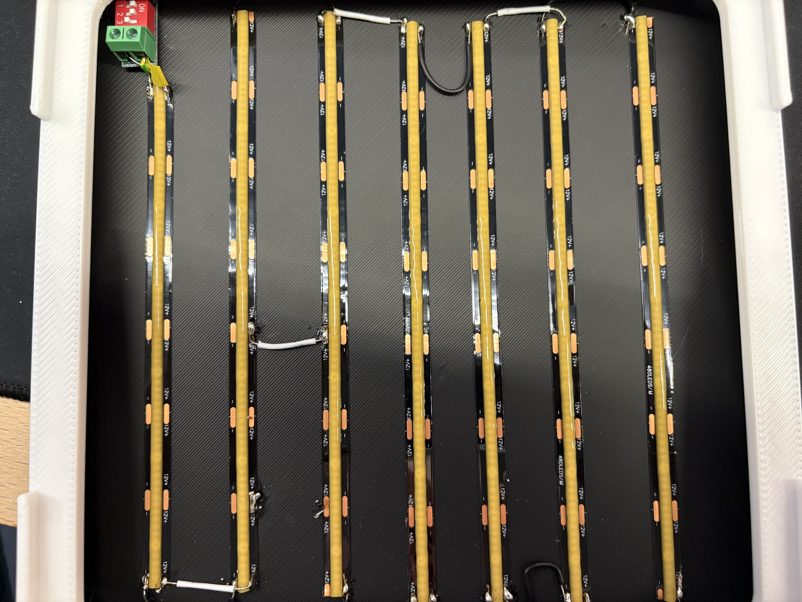
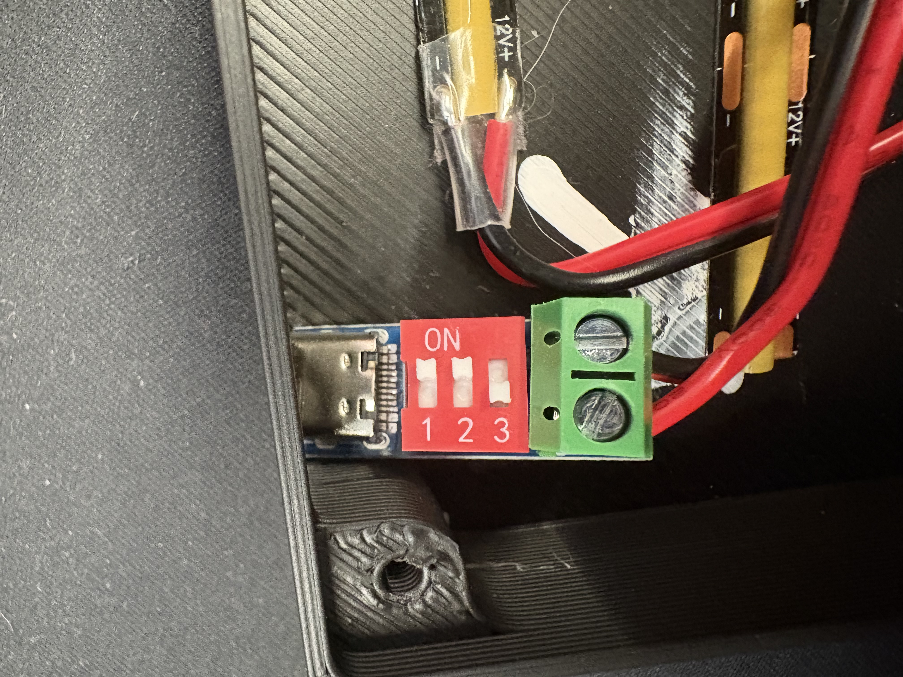
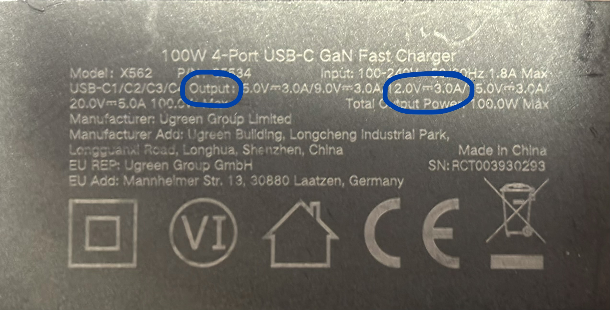
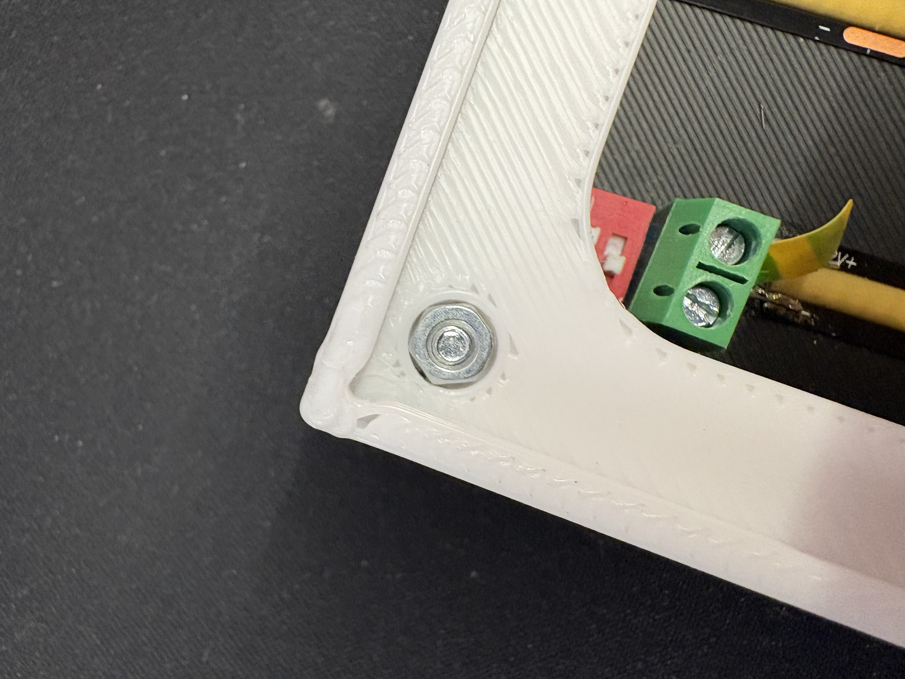

# Leaf Measurement App - Dokumentation

Leaf Measurement ist eine webbasierte Anwendung zum Vermessen von Blattflaechen innerhalb eines Marker-Rahmens. Die Analyse laeuft im Browser; der Node-Server liefert die App aus und speichert Messungen erst, wenn eine Messung archiviert wird.

**Live-App:** https://leafmeasurement.casparniemeyer.com

## Reiter

- [Installation](#installation)
- [Box bauen](#box-bauen)
- [Inbetriebnahme mit der Box](#inbetriebnahme-mit-der-box)
- [Inbetriebnahme mit dem Tracking Sheet](#inbetriebnahme-mit-dem-tracking-sheet)
- [Messung und Archiv](#messung-und-archiv)
- [Einstellungen](#einstellungen)
- [Hinweise zur Genauigkeit](#hinweise-zur-genauigkeit)

## Installation

### Voraussetzungen

- Node.js 20 oder neuer
- Ein aktueller Browser mit Kamera-Unterstuetzung
- Fuer Kamera-Nutzung im Browser: `https://...` oder lokal `localhost`

### Lokal starten

```bash
npm start
```

Standard-Adresse:

```text
http://localhost:8080/
```

Optionaler Port:

```bash
PORT=3000 npm start
```

Unter Windows PowerShell:

```powershell
$env:PORT=3000
npm start
```

### Produktion

Empfohlene Umgebungsvariablen:

```bash
PUBLIC_URL=https://leafmeasurement.casparniemeyer.com
JWT_SECRET=<mindestens 32 zufaellige Zeichen>
HOST=127.0.0.1
PORT=8881
TRUST_PROXY=true
```

Fuer E-Mail-Verifizierung und Passwort-Reset muss SMTP konfiguriert sein. Ohne SMTP schreibt die lokale Entwicklung Mails in `data/mail-outbox.jsonl`.

## Box bauen

Die Messbox besteht aus drei gedruckten Teilen:

- untere Schale
- Deckel
- Tracking Plate

### Druckdateien

- Fusion-Datei: [leaf-measurement-box.f3d](assets/box/leaf-measurement-box.f3d)
- 3MF-Datei: [leaf-measurement-box.3mf](assets/box/leaf-measurement-box.3mf)

Empfehlung: Die **3MF-Datei** verwenden. Sie wurde in Orca Slicer erstellt und enthaelt bereits das vorbereitete Backing sowie die Assembly der Teile. Die Fusion-Datei ist vor allem fuer Anpassungen am Modell gedacht.

### Material und Komponenten

| Komponente | Hinweis |
| --- | --- |
| LED-Streifen | Empfehlung: https://amzn.to/4ePdf3e |
| USB-C-PD-Modul | Empfehlung: https://amzn.to/3R28YQW |
| Museumsglas | Wichtig: genau 20 x 20 cm; andere Groessen passen nicht. Empfehlung: https://amzn.to/4vc2HQz |
| M3-Muttern | Werden in die Loecher des Deckels gedrueckt. |
| M3x20-mm-Schrauben | Deckel von unten verschrauben. |
| PD-Netzteil oder PD-Powerbank mit 12-V-Ausgang | Muss USB-C Power Delivery und 12 V Ausgangsspannung unterstuetzen. |

Getestete Stromversorgungen:

- Powerbank: https://amzn.to/4vdEedy
- Ladegeraet: https://amzn.to/4fmr21q

### LED-Streifen einbauen

Nach dem Druck werden die LED-Streifen in die untere Schale geklebt. Die Streifen werden in Reihen verlegt und miteinander verbunden. Danach werden sie an das USB-C-PD-Modul angeschlossen.



Wichtig:

- Polaritaet beachten: Plus zu Plus, Minus zu Minus.
- Loetstellen und Draehte mechanisch entlasten.
- Vor dem Einsetzen des Deckels kurz testen, ob alle LED-Reihen gleichmaessig leuchten.

### PD-USB-C-Modul auf 12 V einstellen

Am PD-USB-C-Modul das rote Einstellfeld fuer 12 V so setzen:

- Position 1: `ON`
- Position 2: `ON`
- Position 3: `OFF`



Nur eine Powerbank oder ein Netzteil verwenden, das USB-C Power Delivery mit 12 V Ausgang unterstuetzt. Auf dem Netzteil bzw. der Powerbank sollte 12 V als Ausgangsspannung angegeben sein.



### Deckel montieren

In die Loecher des Deckels werden M3-Muttern gedrueckt. Anschliessend wird der Deckel von unten mit M3x20-mm-Schrauben befestigt.



### Box verwenden

Auf die fertige Box wird die Tracking Plate gelegt. Das Blatt wird zwischen Tracking Plate und Museumsglas gelegt, sodass es flach und reproduzierbar positioniert ist.

Wichtig: Das Museumsglas muss **genau 20 x 20 cm** gross sein. Andere Glasgroessen passen in diese Box nicht.

## Inbetriebnahme mit der Box

Die Standardwerte der App fuer **Physische Breite cm** und **Physische Hoehe cm** sind fuer die Messbox gedacht. Sie beschreiben den realen Abstand zwischen den Marker-Mittelpunkten der Box.

1. Box wie im Abschnitt [Box bauen](#box-bauen) vorbereiten.
2. Blatt flach in den Messbereich legen.
3. Kamera starten oder ein Bild hochladen.
4. Pruefen, ob alle vier Marker im Fullframe sichtbar sind.
5. In den Einstellungen die Standardwerte fuer physische Breite/Hoehe verwenden: 17,0 cm / 170 mm, solange die Box-Geometrie unveraendert ist.
6. `Cropped` pruefen: Der Ausschnitt muss sauber entzerrt und quadratisch wirken.
7. HSV-Regler nur anpassen, wenn Blatt und Hintergrund nicht sauber getrennt werden.
8. Messung pruefen und bei Bedarf manuell nachzeichnen.
9. Mit **Archivieren** im aktiven Projekt speichern.

Wenn Marker verdeckt sind, stark spiegeln oder nicht vollstaendig sichtbar sind, kann die Perspektivkorrektur falsch werden.

## Inbetriebnahme mit dem Tracking Sheet

Das Tracking Sheet ist eine separate Messvorlage. Die Standardwerte fuer Breite/Hoehe der Box gelten hier nicht automatisch.

1. Tracking Sheet herunterladen:
   - In der App: **Projekte & Archiv -> Hilfe -> Tracking Sheet herunterladen**
   - Direkt: `/tracking-sheet.pdf`
2. Sheet in Originalgroesse ausdrucken. Keine automatische Skalierung im Druckdialog verwenden.
3. Nach dem Druck die reale Breite und Hoehe zwischen den Marker-Mittelpunkten messen.
4. Diese Werte in der App unter **Physische Breite cm** und **Physische Hoehe cm** eintragen.
5. Blatt flach auf das Sheet legen und Schatten/Reflexionen vermeiden.
6. Kamera starten oder ein Foto hochladen.
7. Pruefen, ob `Cropped` die Sheet-Flaeche korrekt abbildet.
8. Erst danach Messung archivieren.

Wichtig: Schon kleine Druckskalierungen veraendern die Flaechenberechnung. Fuer reproduzierbare Ergebnisse sollten die gemessenen Sheet-Masse dokumentiert und fuer alle Messungen derselben Druckvorlage wiederverwendet werden.

## Messung und Archiv

Die App kann Livebilder aus der Kamera oder ein hochgeladenes Bild analysieren.

- **Fullframe** zeigt das komplette Eingabebild mit Marker-Erkennung.
- **Cropped** ist die entzerrte Arbeitsflaeche innerhalb der Marker.
- **Ergebnis** zeigt Blattkontur, Convex Hull und Schadensflaechen.
- **Schadensmaske** zeigt die kombinierte Schadensmaske.

Mit **Archivieren** werden Messwerte, Beschreibung, Notizen und Bilder im aktiven Projekt gespeichert. Der Projekt-Download liefert ein ZIP mit CSV und Archivbildern.

## Manuelle Werkzeuge

- **Freeze / Live**: aktuelles Bild einfrieren oder wieder zum Livebild wechseln.
- **Schaden**: zusaetzliche Schadensbereiche markieren.
- **Korrekt**: falsch erkannte Schaeden als gesunde Blattflaeche korrigieren.
- **Aus Flaeche entfernen**: Bereiche komplett aus der Berechnung herausnehmen.
- **Radierer**: manuelle Markierungen entfernen.
- **Alles loeschen**: alle manuellen Masken der aktuellen Ansicht entfernen.
- **Groesse**: Pinsel- und Radierergroesse.

## Einstellungen

### Sprache und Darstellung

- **Sprache**: Deutsch oder Englisch.
- **Dunkelmodus**: wechselt die Darstellung.

### Eingabe und Messgeometrie

- **Bild**: Datei von der Festplatte laden. Sobald ein Bild geladen wird, verwendet die Analyse automatisch diese Bilddatei.
- **Physische Breite cm**: reale Breite zwischen den Marker-Mittelpunkten.
- **Physische Hoehe cm**: reale Hoehe zwischen den Marker-Mittelpunkten.
- **Digitale Aufloesung px**: Aufloesung der entzerrten Arbeitsflaeche.
- **Analyse-FPS**: Haeufigkeit der schweren Bildanalyse pro Sekunde.

### HSV Live-Grenzen

- **Hue**: Farbtonbereich.
- **Saturation**: Saettigungsbereich.
- **Value**: Helligkeitsbereich.
- **Kernelgroesse**: Rauschfilterung fuer die Blattmaske.

### Masken

- **Manuelle Masken einrechnen**: manuelle Korrekturen in die Berechnung aufnehmen.
- **Convex-Randschaeden**: Flaeche zwischen Blattkontur und Convex Hull als Randschaden werten.
- **Zeichnen auf Blattmaske begrenzen**: manuelle Markierungen auf die erkannte Blattflaeche begrenzen.
- **Maske schrumpfen px**: erkannte Blattmaske vor der Begrenzung verkleinern.
- **Auto-Schaeden auf Cropped**: automatisch erkannte Schaeden direkt im Cropped-Bild anzeigen.

### Anzeige

- **Marker anzeigen**: erkannte Marker-Kandidaten anzeigen.
- **Flaeche markieren**: Messbegrenzung anzeigen.
- **Umrandung**: Blattkontur anzeigen.
- **Convex Hull**: konvexe Huelle anzeigen.

## Hinweise zur Genauigkeit

- Die Flaechenberechnung haengt direkt von den eingetragenen physischen Breite-/Hoehe-Werten ab.
- Die Box-Standardwerte nicht fuer das Tracking Sheet uebernehmen, wenn das Sheet nicht exakt dieselbe Geometrie hat.
- Druckskalierung, Kamerawinkel, Schatten und Reflexionen koennen Messergebnisse beeinflussen.
- Die Convex-Hull-Methode ist eine Schaetzung und funktioniert am besten bei einfachen Blattformen.
- Manuelle Korrekturen gelten fuer die aktuelle Messung und werden beim Archivieren gespeichert.

## Datenschutz und Sicherheit

- Live-Kamerabilder werden im Browser analysiert.
- Daten werden erst beim Archivieren an den Server gesendet.
- Wir behalten uns vor, archivierte Messdaten in anonymisierter Form zu verwenden, um bessere Standardwerte zu finden, die Messgenauigkeit zu erhoehen und moeglicherweise ein Vision-Modell fuer Blattschaeden zu entwickeln oder zu verbessern. Dafuer werden nur Bilder, Messwerte und technische Einstellungen verwendet; Beschreibung, Notizen, Projektbezug, Benutzerbezug und Kontodaten werden nicht einbezogen.
- Benutzer koennen dies unter **Profil -> Datenschutz -> Opt-out aktivieren** deaktivieren. Bei aktivem Opt-out werden die eigenen archivierten Messungen nicht in den internen anonymisierten Export uebernommen; die interne Sammlung wird beim Speichern der Einstellung neu aufgebaut.
- Der interne anonymisierte Export liegt ausschliesslich serverseitig unter `data/anonymized-measurements/` mit `measurements.csv` und dem Unterordner `images/`. Dieser Ordner wird nicht ueber UI, Projekt-ZIP oder API ausgeliefert und ist nur ueber Server-/Dateisystemzugriff erreichbar.
- Sessions laufen ueber `HttpOnly`-Cookies.
- Passwoerter werden mit Salt und `scrypt` gespeichert.
- E-Mail-Verifizierungs- und Reset-Tokens werden gehasht gespeichert.
- Produktive Deployments sollten Backups fuer `data/` und `archive/projects/` einrichten.
