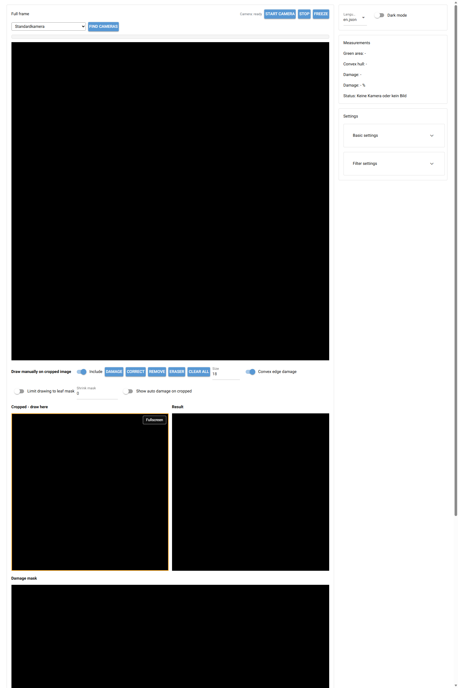
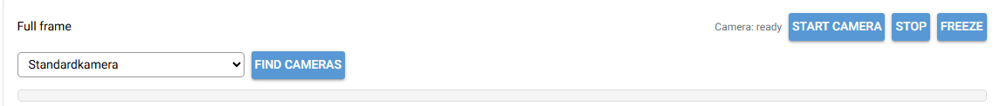
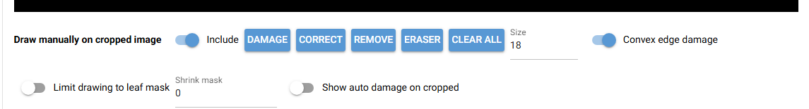
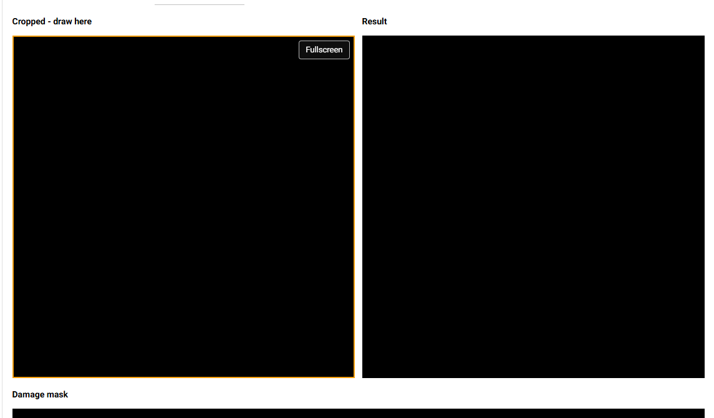
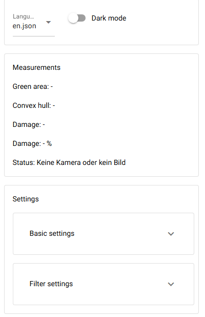

# Leaf Measurement App - Dokumentation

Diese App misst Blattflächen in einem ArUco-Marker-Quadrat und schätzt Blattschäden. Sie kann Livebilder aus der Browser-Kamera oder ein hochgeladenes Bild verarbeiten. Die App erkennt die vier Marker, entzerrt den Bereich zwischen ihnen, filtert grüne Blattbereiche und berechnet daraus Fläche, Convex-Hull-Fläche und Schadensanteil.

## App Starten

1. Virtuelle Umgebung aktivieren:

```powershell
.\.venv\Scripts\Activate.ps1
```

2. App starten:

```powershell
python ui.py
```

3. Im Browser öffnen:

```text
http://127.0.0.1:8080/
```

Wenn die App von anderen Geräten im gleichen Netzwerk geöffnet werden soll, kann die Adresse des Rechners verwendet werden lauscht. Beispiel:

```text
http://<IP-des-Rechners>:8080/
```

## Überblick



Die Oberfläche besteht aus vier Hauptbereichen:

- Links oben: Kamera- und Fullframe-Vorschau
- Links mittig: manuelle Zeichenwerkzeuge
- Links unten: Cropped-, Result- und Damage-Mask-Vorschauen
- Rechts: Sprache, Dunkelmodus, Messwerte und Einstellungen

## Kamera Und Fullframe



| Element | Funktion |
| --- | --- |
| Kamera-Auswahl | Wählt die Browser-Kamera aus. Wenn keine Kamera gewählt ist, wird die Standardkamera verwendet. |
| Find cameras / Kameras suchen | Lädt die Kameraliste neu und ersetzt die bisherige Liste vollständig. |
| Camera status / Kamera-Status | Zeigt den aktuellen Kamera-Zustand, z.B. bereit, aktiv, Fehler oder unterbrochen. |
| Start camera / Kamera starten | Startet die Browser-Kamera und sendet regelmäßig Frames an den Server. |
| Stop | Stoppt den Browser-Kamera-Stream. |
| Freeze | Friert den aktuellen Frame ein. Danach werden Messung und Zeichnungen auf diesem Stand durchgeführt. |
| Live | Erscheint nach Freeze. Schaltet zurück zum Livebild. |

Die Fullframe-Vorschau zeigt das unveränderte Kamerabild. Dort sollten alle vier ArUco-Marker sichtbar sein. Wenn die Marker nicht erkannt werden, kann die App keinen sauberen Zuschnitt erzeugen.

## Manuelle Zeichenwerkzeuge



Gezeichnet wird auf dem `Cropped`-Bild, nicht auf dem Fullframe. Jede Browser-Session hat eine eigene manuelle Maske.

| Element | Funktion |
| --- | --- |
| Include / Einrechnen | Schaltet manuelle Masken in Berechnung und Ergebnisanzeige ein oder aus. |
| Damage / Schaden | Malt manuelle Schadensbereiche. Diese werden zur Schadensfläche addiert. Überlappungen mit automatisch erkannten Schäden werden nur einmal gezählt. |
| Correct / Korrekt | Malt Bereiche, die wieder zur gesunden Blattfläche gezählt werden sollen. Diese Bereiche entfernen Schaden und erhöhen die grüne Fläche. |
| Remove / Entfernen | Entfernt Bereiche komplett aus der Flächenberechnung, ohne sie als Schaden zu zählen. Nützlich für Fremdobjekte, Stiele, Markerreste oder falsch erkannte Bereiche. |
| Eraser / Radierer | Löscht manuelle Damage-, Correct- und Remove-Markierungen im gezeichneten Bereich. |
| Clear all / Alles löschen | Löscht alle manuellen Masken der aktuellen Session. |
| Size / Größe | Legt die Pinsel- und Radierergröße in Pixeln fest. |
| Convex edge damage / Convex-Randschäden | Schaltet die automatische Schadensschätzung zwischen Blattkontur und Convex Hull ein oder aus. |
| Limit drawing to leaf mask / Zeichnen auf Blattmaske begrenzen | Manuelle Markierungen zählen nur innerhalb der automatisch erkannten Blattfläche. |
| Shrink mask / Maske schrumpfen | Schrumpft die erkannte Blattmaske vor der Begrenzung. Damit können Randbereiche bewusst ausgeschlossen werden. |
| Show auto damage on cropped / Auto-Schäden auf Cropped | Zeigt automatisch erkannte Schäden rot direkt im Cropped-Bild, damit man beim Zeichnen sieht, was bereits erkannt wurde. |

### Farbliche Darstellung

| Farbe | Bedeutung |
| --- | --- |
| Rot | erkannter Schaden |
| Orange | manuell hinzugefügter Schaden |
| Grün | manuelle Korrektur, wird als gesunde Fläche gezählt |
| Violett | manuell aus der gesamten Berechnung entfernter Bereich |

## Vorschaufenster



| Vorschau | Bedeutung |
| --- | --- |
| Cropped | Entzerrter Bereich innerhalb der vier ArUco-Marker. Hier wird gezeichnet. |
| Fullscreen | Öffnet das Cropped-Zeichenfeld als zentriertes Vollbild-Quadrat. Besonders hilfreich auf dem Handy. |
| Result | Zeigt das gemessene Ergebnis mit farbigen Masken und optionalen Konturen. |
| Damage mask | Zeigt die kombinierte Schadensmaske als reine Maske. |

Im Vollbildmodus bleiben Cropped-Bild und Zeichen-Canvas gleich groß, damit die gemalten Koordinaten exakt zur Vorschau passen.

## Rechte Seitenleiste



| Bereich | Funktion |
| --- | --- |
| Language / Sprache | Wechselt die UI-Sprache ohne Reload. Einstellungen und Masken bleiben erhalten. |
| Dark mode / Dunkelmodus | Schaltet die Oberfläche hell/dunkel. |
| Measurements / Messwerte | Zeigt aktuelle Messergebnisse. |
| Basic settings / Grundeinstellungen | Enthält Eingabemodus, Upload und physische Marker-Maße. |
| Filter settings / Filtereinstellungen | Enthält Kernelgröße und HSV-Schieberegler für den Farbfilter. |

## Messwerte

| Messwert | Bedeutung |
| --- | --- |
| Green area / Grüne Fläche | Fläche, die als gesundes grünes Blatt erkannt oder manuell korrigiert wurde. |
| Convex hull / Convex Hull | Fläche der konvexen Hülle um das Blatt, abzüglich manuell entfernter Bereiche. |
| Damage / Schaden | Kombinierte Schadensfläche aus automatischen und manuellen Schäden. |
| Damage % / Schaden % | Schadensfläche relativ zur Convex-Hull-Fläche. |
| Status | Gibt an, ob Marker und Blatt erkannt wurden oder ob ein Fehler vorliegt. |

## Grundeinstellungen

| Einstellung | Bedeutung |
| --- | --- |
| Camera/image mode / Modus Kamera/Bild | Wählt zwischen Live-Kamera und hochgeladenem Bild. |
| Image / Bild | Lädt ein Bild von der Festplatte. Nach dem Upload wird automatisch auf Bildmodus geschaltet. |
| Physical width / Physische Breite | Reale Breite zwischen den Markern, Mitte zu Mitte. |
| Physical height / Physische Höhe | Reale Höhe zwischen den Markern, Mitte zu Mitte. |
| Digital resolution / Digitale Auflösung | Größe des entzerrten Crops in Pixeln. Höhere Werte liefern mehr Detail, brauchen aber mehr Rechenzeit. |

## Filtereinstellungen

Die App nutzt HSV-Farbfilter, um Blattbereiche vom Hintergrund zu trennen.

| Regler | Bedeutung |
| --- | --- |
| Hue / Farbton | Farbtonbereich. Normalerweise ist eine Änderung hier nicht nötig |
| Saturation / Sättigung | Mindest- und Höchst-Sättigung. Hilft, graue/weiße Hintergründe auszuschließen. |
| Value / Helligkeit | Mindest- und Höchst-Helligkeit. Hilft bei Schatten und Reflexionen. |
| Kernel size / Kernelgröße | Steuert die Rauschfilterung. Größere Werte entfernen kleine Störungen, können aber feine Blattdetails verlieren. |

## Berechnungslogik

1. Die App sucht vier ArUco-Marker.
2. Aus den Markerpositionen wird eine Perspektivtransformation berechnet.
3. Der Bereich zwischen den Markern wird als quadratisches Cropped-Bild entzerrt.
4. HSV-Grenzen erzeugen eine grüne Blattmaske.
5. Die größte Blattkontur wird gewählt.
6. Aus der Kontur wird eine Convex Hull berechnet.
7. Automatische Schäden entstehen aus:
   - Bereichen innerhalb der Blattkontur, die nicht grün sind
   - optional Bereichen zwischen Blattkontur und Convex Hull
8. Manuelle Masken werden eingerechnet:
   - Damage wird per Union zur Schadensmaske addiert
   - Correct entfernt Schaden und zählt als grüne Fläche
   - Remove entfernt Bereiche aus grüner Fläche, Hull und Schaden
9. Überlappungen werden über Maskenoperationen behandelt, damit Flächen nicht doppelt gezählt werden.

## Empfohlener Workflow

1. Blatt und vier ArUco-Marker vollständig ins Bild bringen.
2. Kamera starten oder Bild hochladen.
3. Prüfen, ob `Cropped` sinnvoll aussieht.
4. HSV-Regler einstellen, bis das Blatt sauber erkannt wird.
5. Bei Bedarf `Show auto damage on cropped` einschalten.
6. Mit `Schaden`, `Korrekt` und `Entfernen` manuell nacharbeiten.
8. Messwerte rechts ablesen.

## Hinweise Und Grenzen

- Die Convex-Hull-Schätzung ist bei einfachen Blattformen hilfreich, aber bei stark gezackten oder komplexen Blättern nur eine Näherung welche natürliche Formen als Schäden markieren kann.
- Reflexionen, Schatten und sehr helle Blätter können HSV-Filterung erschweren.
- Manuelle Korrekturen gelten nur für die aktuelle Browser-Session.
- Wenn die Seite neu geöffnet wird, entsteht eine neue Session mit den standard Einstellungen.
- Werden Marker stark verdeckt oder falsch erkannt, kann die Perspektive verzerrt werden.

